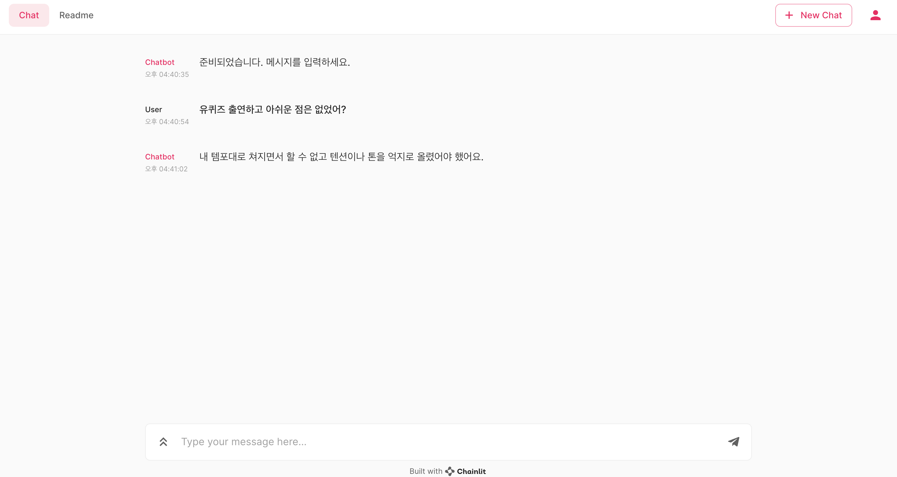

# StreamAssist-Bot

본 레포지토리는 스트리머의 개인정보에 대한 답변을 대신 해주는 챗봇을 만드는 프로젝트입니다.




### 실행 방법 
1. requirement 설치 

```
pip install -r requirements.txt
```

2. 채팅 화면 접속 
```
chainlit run main.py
```

3. 실행 종료 
```
control + c (in terminal)
```

## Error 발생 시 해결 방법 
```
ERROR:    [Errno 48] error while attempting to bind on address ('0.0.0.0', 8000): address already in use
```

- 원인: chainlit 접속에 필요한 8000번 포트를 이미 사용 중인 경우 발생하는 에러 

### 해결 방법 
1. 8000 포트를 사용중인 프로세스 확인
```
sudo lsof -i:8000
```

2. 프로세스 죽이기 
```
kill $PID

kill -9 $PID  //to forcefully kill the port
```

## 개발 계획 
- [x] 채팅 GUI 추가
- [ ] requirements 추가 
- [ ] 데이터 증강 기능 추가 
- [ ] 답변 말투 변경 
